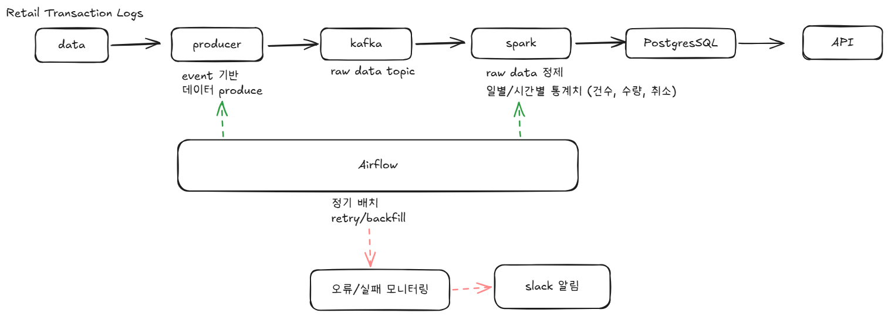
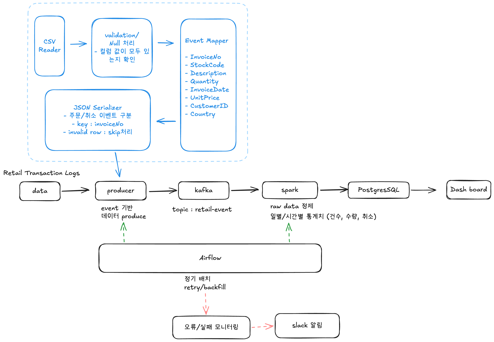

# 데이터 엔지니어링 프로젝트
## 프로젝트 개요
**Online Retail Event Collection Pipeline**

>💡본 프로젝트는 온라인 리테일 CSV 데이터를 실시간 이벤트처럼 재생하여 Kafka로 수집하는 파이프라인을 구현하였다. 각 거래 row를 주문 또는 취소 이벤트로 변환하고, `invoice_no`를 key로 하여 `retail-events` topic에 전송함으로써 Kafka 기반 이벤트 수집 구조를 설계하였다.


### 데이터

**Retail Transaction Logs**

구매 이력 데이터판매 분석 / 피크 시간 탐지

https://archive.ics.uci.edu/dataset/352/online%2Bretail

- data/online-retail.csv 에 저장

**컬럼**
- InvoiceNo : 송장번호 (앞에 C : 취소) 
- Description : 제품명 (상품 특성 구분)
- StockCode : 상품 코드(각 제품에 고유하게 할당된 5자리 정수)
- Quantity : 품목 수량
- InvoiceDate(dd/mm/yyyy hh:mi) : 각 거래가 생성된 날짜와 시간
- unitPrice : 제품 단위 가격 (영국 단위)
- customerID : 고객 ID(5자리 정수)
- Country : 고객 거주 국가명

### 흐름

CSV 원본 데이터 → Python Producer → Kafka Topic → Consumer/Spark(또는 향후 처리) → 저장/분석

## 파이프라인 구성도




## Kafka 수집 설계

https://excalidraw.com/#json=5SDq4YuITu_4sUBd2y6Os,qb_f3KVSaG0Gi11H0w7zbg



### 설계 포인트

- 주문 / 취소 이벤트를 구분
- key는 `invoice_no`
- Kafka message key는 `InvoiceDate` 기준 오름차순 정렬 후 전송
- 날짜 파싱이 실패한 row는 제외
- `future.get()`을 통해 전송 결과를 확인하고 성공/실패를 로그로 출력
- 향후 invalid row 저장, dead-letter 처리, S3 적재 등으로 확장 가능

## Producer 코드 흐름
1. CSV 파일(`data/online_retail.csv`)을 읽는다.
2. `InvoiceDate` 컬럼을 datetime 형식으로 변환한다.
3. 날짜 변환이 실패한 row는 제외한다.
4. `InvoiceDate` 기준으로 오름차순 정렬한다.
5. 각 row를 순회하면서 `InvoiceNo`가 `C`로 시작하는지 확인하여 이벤트 유형을 결정한다.
   - `C`로 시작하면 `cancel`
   - 그 외는 `order`
6. row 데이터를 JSON 메시지 형태로 변환한다.
7. `invoice_no`를 Kafka key로 하여 `retail-events` topic에 전송한다.
8. `future.get()`으로 전송 결과를 확인하고 로그를 출력한다.
9. 종료 전 `flush()`와 `close()`를 호출하여 남은 메시지를 전송하고 리소스를 정리한다.

## 메시지 생성 방식

각 거래 row는 하나의 Kafka 메시지로 변환된다.

- `InvoiceNo`가 `C`로 시작하면 `cancel`
- 그 외는 `order`
- Kafka key는 `invoice_no`
- 메시지 값(value)은 JSON 형식

```
{
	'event_id': '536365-85123A', 
	'event_type': 'order', 
	'invoice_no': '536365', 
	'stock_code': '85123A', 
	'description': 'WHITE HANGING HEART T-LIGHT HOLDER', 
	'quantity': 6, 
	'unit_price': 2.55, 
	'customer_id': '17850.0', 
	'country': 'United Kingdom', 
	'invoice_timestamp': '12/1/2010 8:26', 
	'metadata': {
		'source': 'online_retail_csv', 
		'version': 'v1'
	}
}
```
## Topic 구성 방식
### Topic 정보
Topic 이름: retail-events
Topic 개수: 1개
역할: 온라인 리테일 주문 및 취소 이벤트 저장

### Partitioning 전략

주문 단위의 순서를 유지하며 처리할 수 있도록 설계
- Partition key: invoice_no

## Configuration

- topic name: `retail-events`
- partition key : `invoice_no`
- partitions: `3`
- replication factor: `1`
- key: `invoice_no`
- value format: JSON
- acks: `all`
- retries: `3`

## Error handling

### 전송 신뢰성 확보

- `acks='all'`
- `retries=3`
- 종료 전 `flush()` / `close()`

### 전송 결과 확인
producer.send() 이후 future.get()을 사용하여 전송 성공 여부를 확인하고 로그를 출력

### 데이터 정제 처리

- InvoiceDate 파싱 실패 row는 제외
- 그 외 세부적인 invalid row 처리 및 dead-letter 관리 로직은 현재 미구현
- 향후 별도 에러 로그 파일 또는 DLQ topic으로 확장 가능

## 향후 확장 방향
- Consumer를 통한 DB 적재
- Spark 기반 스트림 처리
- invalid row 분리 저장
- dead-letter topic 구성
- S3/raw zone 적재 구조 확장

## DB 테이블 생성

``` sql
CREATE DATABASE retail_pipeline;

-- raw 데이터 저장
CREATE TABLE retail_events_raw (
    event_id VARCHAR(100),
    event_type VARCHAR(20),
    invoice_no VARCHAR(30),
    stock_code VARCHAR(30),
    description TEXT,
    quantity INT,
    unit_price NUMERIC(10,2),
    customer_id VARCHAR(30),
    country VARCHAR(100),
    invoice_timestamp TIMESTAMP,
    ingested_at TIMESTAMP,
    load_run_id VARCHAR(30)
);
```
