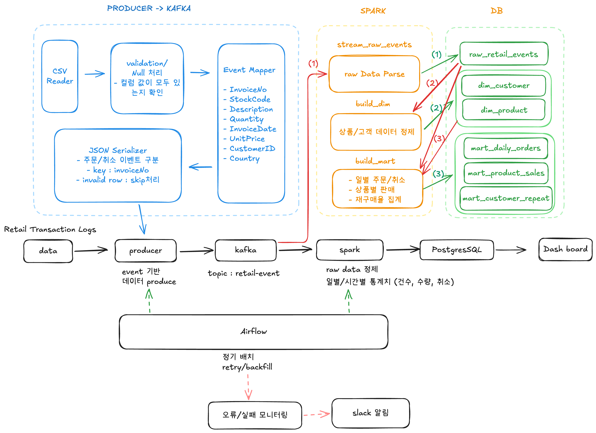
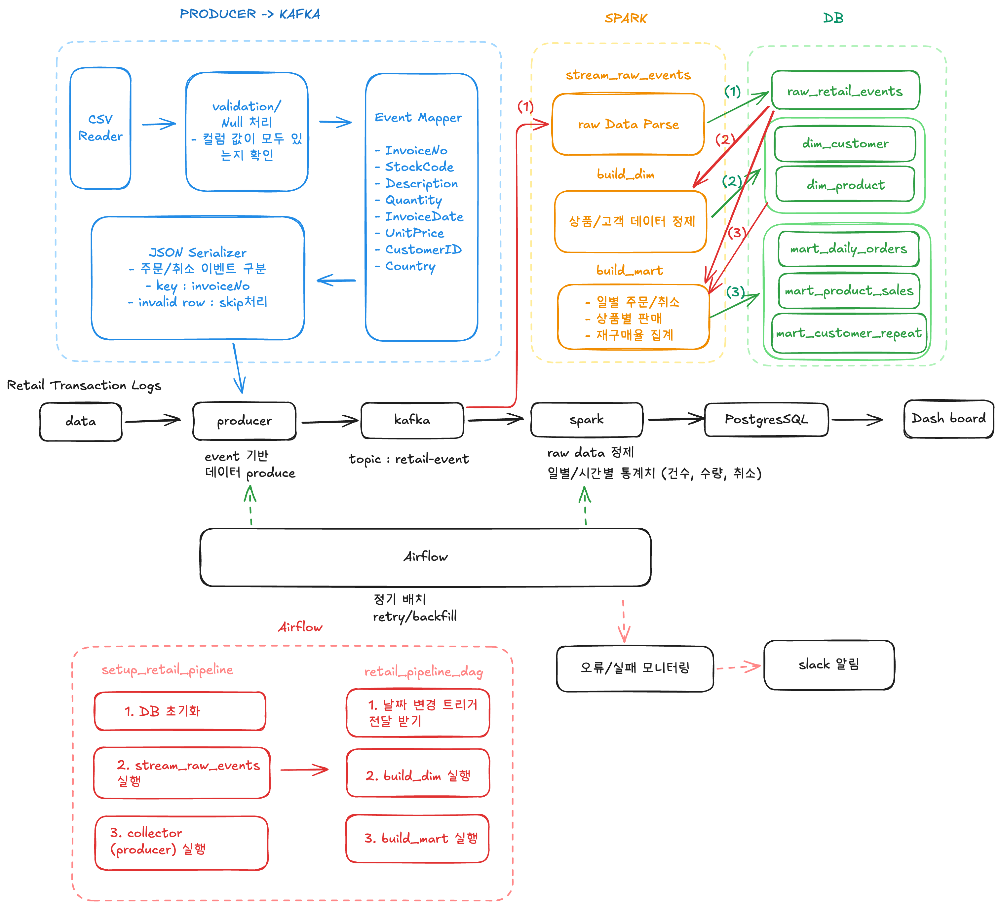

# 데이터 엔지니어링 프로젝트
## 프로젝트 개요
**Online Retail Event Collection Pipeline**

>💡본 프로젝트는 온라인 리테일 CSV 데이터를 실시간 이벤트처럼 재생하여 Kafka로 수집하는 파이프라인을 구현하였다. 각 거래 row를 주문 또는 취소 이벤트로 변환하고, `invoice_no`를 key로 하여 `retail-events` topic에 전송함으로써 Kafka 기반 이벤트 수집 구조를 설계하였다.


### 데이터

**Retail Transaction Logs**

구매 이력 데이터판매 분석 / 피크 시간 탐지

https://archive.ics.uci.edu/dataset/352/online%2Bretail

- data/online-retail.csv 에 저장

**컬럼**
- InvoiceNo : 송장번호 (앞에 C : 취소) 
- Description : 제품명 (상품 특성 구분)
- StockCode : 상품 코드(각 제품에 고유하게 할당된 5자리 정수)
- Quantity : 품목 수량
- InvoiceDate(dd/mm/yyyy hh:mi) : 각 거래가 생성된 날짜와 시간
- unitPrice : 제품 단위 가격 (영국 단위)
- customerID : 고객 ID(5자리 정수)
- Country : 고객 거주 국가명

### 흐름

CSV 원본 데이터 → Python Producer → Kafka Topic → Consumer/Spark(또는 향후 처리) → 저장/분석

## 파이프라인 구성도


## Kafka 수집 설계

https://excalidraw.com/#json=5SDq4YuITu_4sUBd2y6Os,qb_f3KVSaG0Gi11H0w7zbg


### 설계 포인트

- 주문 / 취소 이벤트를 구분
- key는 `invoice_no`
- Kafka message key는 `InvoiceDate` 기준 오름차순 정렬 후 전송
- 날짜 파싱이 실패한 row는 제외
- `future.get()`을 통해 전송 결과를 확인하고 성공/실패를 로그로 출력
- 향후 invalid row 저장, dead-letter 처리, S3 적재 등으로 확장 가능

## Producer 코드 흐름
1. CSV 파일(`data/online_retail.csv`)을 읽는다.
2. `InvoiceDate` 컬럼을 datetime 형식으로 변환한다.
3. 날짜 변환이 실패한 row는 제외한다.
4. `InvoiceDate` 기준으로 오름차순 정렬한다.
5. 각 row를 순회하면서 `InvoiceNo`가 `C`로 시작하는지 확인하여 이벤트 유형을 결정한다.
   - `C`로 시작하면 `cancel`
   - 그 외는 `order`
6. row 데이터를 JSON 메시지 형태로 변환한다.
7. `invoice_no`를 Kafka key로 하여 `retail-events` topic에 전송한다.
8. `future.get()`으로 전송 결과를 확인하고 로그를 출력한다.
9. 종료 전 `flush()`와 `close()`를 호출하여 남은 메시지를 전송하고 리소스를 정리한다.

## 메시지 생성 방식

각 거래 row는 하나의 Kafka 메시지로 변환된다.

- `InvoiceNo`가 `C`로 시작하면 `cancel`
- 그 외는 `order`
- Kafka key는 `invoice_no`
- 메시지 값(value)은 JSON 형식

```
{
	'event_id': '536365-85123A', 
	'event_type': 'order', 
	'invoice_no': '536365', 
	'stock_code': '85123A', 
	'description': 'WHITE HANGING HEART T-LIGHT HOLDER', 
	'quantity': 6, 
	'unit_price': 2.55, 
	'customer_id': '17850.0', 
	'country': 'United Kingdom', 
	'invoice_timestamp': '12/1/2010 8:26', 
	'metadata': {
		'source': 'online_retail_csv', 
		'version': 'v1'
	}
}
```
## Topic 구성 방식
### Topic 정보
Topic 이름: retail-events
Topic 개수: 1개
역할: 온라인 리테일 주문 및 취소 이벤트 저장

### Partitioning 전략

주문 단위의 순서를 유지하며 처리할 수 있도록 설계
- Partition key: invoice_no

## Configuration

- topic name: `retail-events`
- partition key : `invoice_no`
- partitions: `3`
- replication factor: `1`
- key: `invoice_no`
- value format: JSON
- acks: `all`
- retries: `3`

## Error handling

### 전송 신뢰성 확보

- `acks='all'`
- `retries=3`
- 종료 전 `flush()` / `close()`

### 전송 결과 확인
producer.send() 이후 future.get()을 사용하여 전송 성공 여부를 확인하고 로그를 출력

### 데이터 정제 처리

- InvoiceDate 파싱 실패 row는 제외
- 그 외 세부적인 invalid row 처리 및 dead-letter 관리 로직은 현재 미구현
- 향후 별도 에러 로그 파일 등으로 확장 가능

---

# Spark 설계
### Spark 파이프라인 업데이트


## 데이터 흐름

- Producer가 Kafka topic `retail-events`로 주문/취소 이벤트를 전송한다.
- `stream_raw_retail_events`가 Kafka 메시지를 읽고, JSON 파싱 및 기본 전처리를 수행한 뒤 `raw_retail_events`에 적재한다.
- `batch_dim`가 `raw_retail_events`를 읽어 `dim_customer`, `dim_product`를 생성한다.
- `batch_mart`가 `raw_retail_events`, `dim_customer`, `dim_product`를 기반으로 일 단위 mart를 생성한다.
- Dashboard는 `mart_daily_orders`, `mart_product_sales`, `mart_customer_repeat`를 조회하여 차트를 생성한다.

## Spark 전처리 설계

### **Job 1. stream_raw_retail_events**

**📌데이터 처리 흐름**

- Kafka topic `retail-events`에서 JSON 메시지를 읽는다.
- 메시지에서 `invoice_no`, `stock_code`, `description`, `quantity`, `unit_price`, `customer_id`, `country`, `invoice_timestamp` 등을 추출한다.
- `event_type`을 생성한다. 주문/취소 여부는 원천 데이터 규칙에 따라 구분한다.
- `invoice_timestamp`를 기준으로 `invoice_date`, `invoice_time`를 파생한다.
- `ingested_at`, `load_run_id`를 추가한다.
- 중복 이벤트를 최소화한 뒤 `raw_retail_events`에 적재한다.

**📌구현 방식 :**

- streaming data

**📌역할:**

- source 읽기
- order/cancel 구분
- raw 적재

**📌입력:**

- CSV / Kafka / replay 데이터

**📌출력:**

- raw_retail_events

### **Job2. batch_dim**

**📌 데이터 처리 흐름**

- `retail_events_raw`를 JDBC로 읽는다.
- 고객 기준으로 `first_purchase_at`, `last_purchase_at`, `total_order_count`를 계산하여 `dim_customer`를 생성한다.
- 상품 기준으로 `stock_code`, `category`, `product_name`, `latest_unit_price`를 정리하여 `dim_product`를 생성한다.
- 현재 단계에서는 batch 방식으로 전체 데이터를 다시 읽어 dimension을 생성하는 방식으로 설계한다.

**📌구현 방식 :**

- batch (일별)
    - 일단 `full refresh (overwrite)`
    - 추후 `incremental + merge` 고려

**📌역할:**

- raw  기반 product 중간 결과 생성 및 적재
- raw  기반 customer 중간 결과 생성 및 적재

**📌출력:** 

- dim_product
- dim_customer

### **Job 3. batch_mart**

**📌 데이터 처리 흐름**

- `retail_events_raw`, `dim_customer`, `dim_product`를 읽는다.
- 날짜 기준으로 주문/취소 건수 및 금액을 집계하여 `mart_daily_orders`를 생성한다.
- 날짜+상품 기준 집계를 통해 `mart_product_sales`를 생성한다.
- 고객 재구매 기준을 적용하여 `mart_customer_repeat`를 생성한다.

**📌구현방식:**

- batch(일별 -dim 이후)

**📌역할:**

- raw와 dim 기반으로 mart 생성

**📌출력:**

- 일별 주문/취소 건수
- 상품별 판매량/매출
- 고객 재구매율
- 고객-상품 재구매 여부


### **데이터 흐름 구조 상세**
    
    1. Raw
    
    원천 이벤트 저장
    
    들어갈 것:
    
    - invoice_time : 주문 시간
    - invoice_date : 주문 일자
    - invoice_no : 주문ID
    - stock_code : 상품코드
    - category : 카테고리 (상품 코드 뒤 영문 - 없을 경우 ‘ETC’)
    - description : 상품명
    - customer_id : 고객 ID
    - quantity : 수량
    - unit_price : 단가
    - country : 나라
    - event_type(order / cancel) : 주문 구분
        - `invoice_no`가 `C`로 시작하면 cancel
        - 아니면 order
    
    역할:
    
    - 원본 최대한 유지
    - 정제 최소화
    - “무슨 이벤트가 언제 발생했는지” 기록
    
    2. Product / Customer
    
    분석용 기준정보 생성
    
    [Product]
    
    - stock_code 기준 상품 식별
    - description 정리
    - category : stock_code의 코드 뒤 알파벳
        - 없으면 ‘ETC’
    
    [Customer]
    
    - customer_id 기준 고객 식별
    - 첫 구매일 / 마지막 구매일
    - 총 구매 횟수
    - 재구매 고객 여부 계산 기반
    
    역할:
    
    - raw를 바로 대시보드에 쓰지 않고
    - 분석 가능한 형태로 정리
    
    3. Mart
    
    대시보드용 집계
    
    - mart_daily_orders : 당일 구매율
    - mart_product_sales : 상품별 구매율
    - mart_customer_repeat : 고객 재구매율
    
    역할:
    
    - 차트/지표가 바로 붙을 수 있게 요약
    
    ⭐️daily의 기준
    
    - ‘하루가 지남’에 대한 트리거 작동
        
        invoice_timestamp >= data_interval_start
        invoice_timestamp < data_interval_end
        
        

## Error handling 전략

Spark 전처리 및 저장 과정에서 다음과 같은 예외 처리 전략을 적용한다.

- JSON 파싱 실패 시 해당 메시지는 적재 대상에서 제외하고 로그로 남긴다.
- `invoice_timestamp` 파싱이 실패한 경우 적재하지 않고 오류 데이터를 별도로 확인한다.
- `customer_id`, `stock_code` 등 dimension 생성에 필요한 주요 키가 null인 경우 `dim_customer`, `dim_product` 생성 대상에서 제외한다.
- 중복 이벤트는 `event_id` 기준으로 제거한다.
- streaming 적재 시 checkpoint를 사용하여 재시작 시 offset과 상태를 복구할 수 있도록 설계한다.
- batch 처리 실패 시 raw 데이터는 그대로 유지되므로 `batch_dim_data`, `batch_mart`는 재실행 가능하다.

## 처리 전/후 데이터 예시

### 입력 Kafka 메시지 예시

```
{
  "invoice_no":"536365",
  "stock_code":"85123A",
  "category:"A",
  "description":"WHITE HANGING HEART T-LIGHT HOLDER",
  "quantity":6,
  "unit_price":2.55,
  "customer_id":"17850",
  "country":"United Kingdom",
  "invoice_timestamp":"2010-12-01T08:26:00",
  "event_type":"order"
}
```

### 처리 후 `raw_retail_events` 적재 예시

```
{
  "event_id":"event_0001",
  "event_type":"order",
  "invoice_no":"536365",
  "stock_code":"85123A",
  "category":"A",
  "description":"WHITE HANGING HEART T-LIGHT HOLDER",
  "quantity":6,
  "unit_price":2.55,
  "customer_id":"17850",
  "country":"United Kingdom",
  "invoice_timestamp":"2010-12-01T08:26:00",
  "invoice_date":"2010-12-01",
  "invoice_time_str":"08:26:00",
  "ingested_at":"2026-04-22T21:10:00",
  "load_run_id":"run_001"
}
```

### 처리 후 `dim_customer` 예시

```
{
  "customer_id":"17850",
  "first_purchase_at":"2010-12-01T08:26:00",
  "last_purchase_at":"2010-12-09T12:10:00",
  "total_order_count":3,
  "country":"United Kingdom"
}
```

### 처리 후 `dim_product` 예시

```
{
  "stock_code":"85123A",
  "category":"A",
  "description":"WHITE HANGING HEART T-LIGHT HOLDER",
  "product_name":"WHITE HANGING HEART T-LIGHT HOLDER",
  "latest_unit_price":2.55
}
```

## DB구조 설계

### 저장소 선택

저장소

- PostgreSQL 기반의 관계형 DB를 사용

선택 이유

- Spark JDBC 연동이 가능
- raw / dim / mart 계층을 테이블 단위로 구분하여 저장 용이
- SQL 기반 조회가 가능하므로 이후 Dashboard와 연계하기에도 적합

`raw_retail_events`, `dim_customer`, `dim_product`, `mart_daily_orders`, `mart_product_sales`, `mart_customer_repeat`를 모두 DB 테이블로 관리하는 구조


### 저장 주기 및 방식

- `raw_retail_events`: streaming append 적재
- `dim_customer`, `dim_product`: batch 적재
- `mart_daily_orders`, `mart_product_sales`, `mart_customer_repeat`: batch 적재

현재 단계에서는 `batch_dim_data`와 `batch_mart`를 일 단위 batch로 구성한다.

### DB 구조

```sql
CREATE DATABASE retail_pipeline;

-- raw 데이터 저장
CREATE TABLE raw_retail_events(
    event_id VARCHAR(100) PRIMARY KEY,
    event_type VARCHAR(20) NOT NULL,
    invoice_no VARCHAR(30),
    stock_code VARCHAR(5),
    category VARCHAR(5),
    description TEXT,
    quantity INT,
    unit_price NUMERIC(10,2),
    customer_id VARCHAR(5),
    country VARCHAR(100),
    invoice_timestamp TIMESTAMP NOT NULL,
    invoice_date DATE NOT NULL,
    invoice_time_str VARCHAR(8),   -- HH:mm:ss
    ingested_at TIMESTAMP NOT NULL,
    load_run_id VARCHAR(50) NOT NULL
);

-- customer
CREATE TABLE dim_customer (
    customer_id VARCHAR(30) PRIMARY KEY,
    first_purchase_at TIMESTAMP,
    last_purchase_at TIMESTAMP,
    total_order_count INT NOT NULL DEFAULT 0,
    country VARCHAR(20)
);

-- product
CREATE TABLE dim_product (
    stock_code VARCHAR(30) PRIMARY KEY,
    category VARCHAR(30),
    description TEXT,
    latest_unit_price NUMERIC(10,2)
);

-- 당일 구매율
CREATE TABLE mart_daily_orders (
    order_date DATE PRIMARY KEY,
    total_event_cnt INT NOT NULL,
    order_cnt INT NOT NULL,
    cancel_cnt INT NOT NULL,
    total_sales_amount NUMERIC(12,2) NOT NULL,
    order_sales_amount NUMERIC(12,2) NOT NULL,
    cancel_sales_amount NUMERIC(12,2) NOT NULL,
    order_rate NUMERIC(5,2),
    cancel_rate NUMERIC(5,2)
);

-- 상품별 집계
CREATE TABLE mart_product_sales (
    order_date DATE NOT NULL,
    stock_code VARCHAR(30) NOT NULL,
    category VARCHAR(30),
    total_event_cnt INT NOT NULL,
    order_cnt INT NOT NULL,
    cancel_cnt INT NOT NULL,
    order_sales_amount NUMERIC(12,2) NOT NULL,
    cancel_sales_amount NUMERIC(12,2) NOT NULL,
    order_rate NUMERIC(5,2),
    cancel_rate NUMERIC(5,2),
    PRIMARY KEY (order_date, stock_code)
);

-- 고객 재구매율
CREATE TABLE mart_customer_repeat (
    order_date DATE PRIMARY KEY,
    total_customer_cnt INT NOT NULL,
    repeat_customer_cnt INT NOT NULL,
    repeat_customer_rate NUMERIC(5,2)
);
```

- `total_customer_cnt`: 해당 날짜까지 혹은 해당 날짜 기준 집계 대상 고객 수
- `repeat_customer_cnt`: 2회 이상 구매 고객 수
- `repeat_customer_rate`: 재구매 고객 비율

## 실행 방법

```bash
# stream_raw_events 실행
docker exec -it spark-master spark-submit \
  --master spark://spark-master:7077 \
  --packages org.apache.spark:spark-sql-kafka-0-10_2.12:3.4.1 \
  --jars /opt/spark-jars/postgresql-42.7.3.jar \
  /opt/spark-apps/stream_raw_events.py
```

```bash
# build_dim 실행
docker exec -it spark-master spark-submit \
  --master spark://spark-master:7077 \
  --packages org.apache.spark:spark-sql-kafka-0-10_2.12:3.4.1 \
  --jars /opt/spark-jars/postgresql-42.7.3.jar \
  /opt/spark-apps/build_dim.py
```

# Airflow 설계 및 구현

## Airflow 파이프라인
https://excalidraw.com/#json=6pF8jJXIVrFyy7EBjCejX,bL7SalQKRf9rlC_6r-5N0Q



## airflow 아이디 비밀번호 생성
```bash
docker compose exec airflow airflow users create \
  --username admin \
  --firstname admin \
  --lastname user \
  --role Admin \
  --email admin@example.com \
  --password admin
```

## docker 실행 및 DB 초기화 자동화 세팅
### sh 스크립트로 collector를 제외한 모든 작업이 실행되도록 구성
[run_pipeline.sh]
```bash
#!/bin/bash

set -e

  

echo "1. Start containers"

docker compose up -d zookeeper kafka postgres spark-master spark-worker airflow airflow-scheduler

echo "2. Wait for Airflow to load DAGs"
sleep 10

echo "3. Show DAG list"
docker compose exec airflow airflow dags list

echo "4. Unpause DAG"
docker compose exec airflow airflow dags unpause retail_pipeline_dag

echo "5. Trigger DAG"
docker compose exec airflow airflow dags trigger retail_pipeline_dag

echo "6. Airflow UI: http://localhost:8081"
```

## airflow dag 종류
| dag_id                | filepath               | 
| --------------------- | ---------------------- | 
| retail_pipeline       | retail_pipeline_dag.py | 
| setup_retail_pipeline | retail_ingestion.py    | 

### airflow retail_ingestion 구현
dag에서 DB 초기화 및 stream 실행 구성
[순서]
1. 테이블 리셋 (Truncate 사용)
2. stream_raw_events 실행 
3. collector 실행 = producer 실행

### retail_pipeline_dag 구현
`retail_pipeline_dag`에서 dimension과 mart를 배치를 통해 실행할 수 있도록 구현


## 향후 계획

- `batch_mart` 구현 완료
- 상품 description parsing 고도화
- customer/product insert-merge 저장 (현재는 overwrite)
- Airflow DAG 연결
- Dashboard 구현