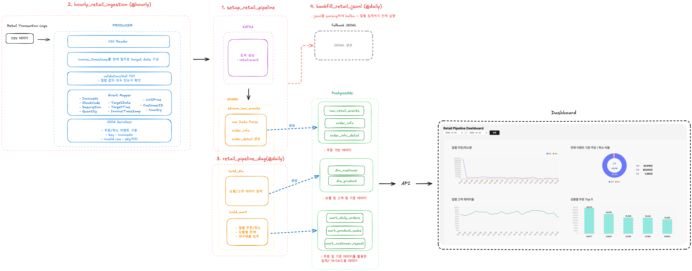
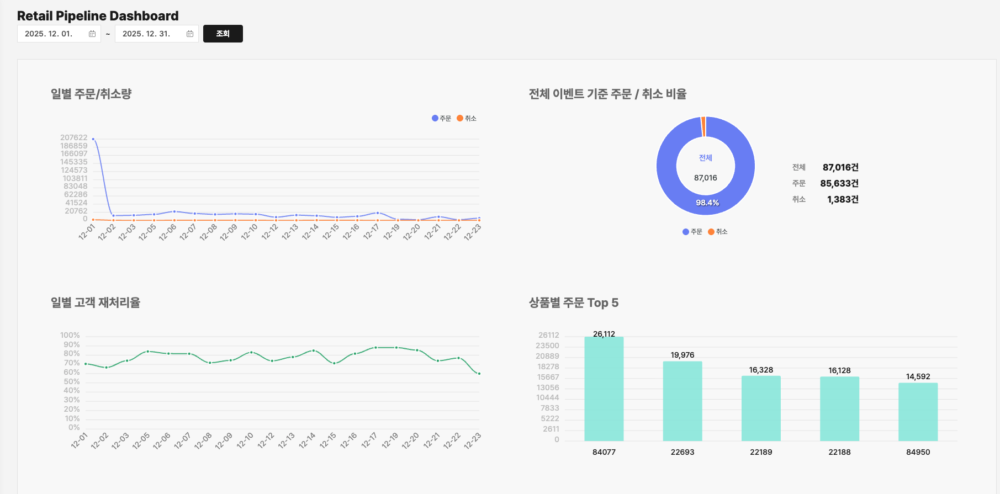

# Online Retail Event Pipeline

온라인 리테일 CSV 데이터를 실시간 이벤트처럼 재생하여 Kafka로 수집하고, Spark Streaming 및 Batch 작업을 통해 PostgreSQL에 적재한 뒤 API와 Dashboard로 제공하는 데이터 엔지니어링 프로젝트이다.

본 프로젝트는 단순히 CSV를 읽어 DB에 넣는 구조가 아니라, 실제 운영 파이프라인에 가까운 흐름을 연습하기 위해 다음 요소를 함께 구성하였다.

- Kafka 기반 이벤트 수집
- Spark Streaming 기반 raw 적재
- Spark Batch 기반 dim/mart 생성
- Airflow 기반 스케줄링 및 재처리
- FastAPI 기반 데이터 조회 API
- Spring Boot + JSP 기반 Dashboard
- fallback JSONL 기반 장애 복구
- Slack 기반 일별 요약 및 DAG 실패 알림

---

## 1. 프로젝트 개요

### 데이터

사용 데이터:

```
Online Retail Dataset
```

데이터 출처:

<https://archive.ics.uci.edu/dataset/352/online%2Bretail>

저장 위치:

```
data/online_retail.csv
```

주요 컬럼:

| 컬럼 | 설명 |
|---|---|
| `InvoiceNo` | 송장번호, `C`로 시작하면 취소 |
| `StockCode` | 상품 코드 |
| `Description` | 상품명 |
| `Quantity` | 수량 |
| `InvoiceDate` | 거래 일시 |
| `UnitPrice` | 상품 단가 |
| `CustomerID` | 고객 ID |
| `Country` | 국가 |

### 전체 흐름

```text
CSV 원본 데이터
↓
Python Producer
↓
Kafka topic: retail-events
↓
Spark Streaming
↓
PostgreSQL raw/order 테이블
↓
Spark Batch
↓
dim/mart 테이블
↓
FastAPI
↓
Spring Boot Dashboard
↓
Slack 알림
```

파이프라인 구성도:

https://excalidraw.com/#json=jg7fOETv2zKRO5BzK5cnp,GX62YSgkzaWFNJVJBN0qBw



---

## 2. 기술 스택

| 영역 | 기술 |
|---|---|
| 이벤트 수집 | Python, Kafka |
| 스트리밍 처리 | Spark Structured Streaming |
| 배치 처리 | Spark Batch |
| 저장소 | PostgreSQL |
| 워크플로 관리 | Airflow |
| API | FastAPI |
| Dashboard | Spring Boot, JSP, JavaScript, ApexCharts |
| 알림 | Slack Incoming Webhook |
| 실행 환경 | Docker Compose |

---

## 3. 주요 구성 요소

### 3-1. Producer 및 Kafka

파일:

```
producer.py
```

역할:

- CSV 데이터를 읽어 주문/취소 이벤트로 변환
- `InvoiceNo`가 `C`로 시작하면 `cancel`, 그 외는 `order`로 구분
- `invoice_no`를 Kafka key로 사용하여 주문 단위 순서 유지
- 전송 실패 시 fallback JSONL 파일로 저장
- invoice 단위 처리를 위해 마지막 row 이후 `complete` 메시지 전송

Kafka topic:

| 항목 | 값 |
|---|---|
| topic | `retail-events` |
| key | `invoice_no` |
| value | JSON |
| bootstrap server | `kafka:29092` |

메시지 예시:

```json
{
  "tag": "in_process",
  "event_id": "536365-85123A",
  "event_type": "order",
  "invoice_no": "536365",
  "stock_code": "85123A",
  "category": "A",
  "description": "WHITE HANGING HEART T-LIGHT HOLDER",
  "quantity": 6,
  "unit_price": 2.55,
  "customer_id": "17850",
  "country": "United Kingdom",
  "invoice_timestamp": "2026-12-01T08:26:00",
  "target_date": "2026-12-01",
  "target_time": "08:26:00",
  "metadata": {
    "source": "online_retail_csv",
    "version": "v1"
  }
}
```

### 3-2. Spark Streaming

파일:

```
jobs/stream_raw_events.py
```

역할:

- Kafka topic `retail-events`에서 메시지 consume
- JSON 파싱 및 기본 컬럼 정리
- `raw_retail_events` 적재
- invoice 단위 complete 메시지를 기준으로 `order_info`, `order_detail` 구성
- checkpoint를 활용하여 streaming offset 복구

출력 테이블:

| 테이블 | 설명 |
|---|---|
| `raw_retail_events` | 원천 이벤트 row 저장 |
| `order_info` | 송장 단위 주문/취소 기본 정보 |
| `order_detail` | 상품 단위 주문/취소 상세 정보 |

### 3-3. Spark Batch

파일:

```
jobs/build_dim.py
jobs/build_mart.py
```

역할:

| Job | 설명 | 출력 |
|---|---|---|
| `build_dim.py` | 고객/상품 기준정보 생성 | `dim_customer`, `dim_product` |
| `build_mart.py` | 대시보드용 집계 생성 | `mart_daily_orders`, `mart_product_sales`, `mart_customer_repeat` |

mart 테이블:

| 테이블 | 설명 |
|---|---|
| `mart_daily_orders` | 일별 주문/취소 건수 및 매출 |
| `mart_product_sales` | 일자+상품 기준 주문/취소 집계 |
| `mart_customer_repeat` | 일별 고객 재구매율 |

### 3-4. Airflow

위치:

```
app/airflow/dags/
```

주요 DAG:

| DAG | 스케줄 | 역할 |
|---|---|---|
| `setup_retail_pipeline` | 수동 | Kafka topic 생성, Spark Streaming 시작 |
| `hourly_retail_ingestion` | `@hourly` | 매시간 collector 실행 및 raw 적재 확인 |
| `retail_pipeline` | `15 0 * * *` | dim/mart 일별 생성 |
| `backfill_retail_jsonl` | `30 0 * * *` | fallback JSONL 재처리 |
| `backfill_retail_pipeline` | 수동 | 지정 구간 재수집 및 재집계 |
| `daily_retail_summary_alert` | `30 8 * * *` | 전일 요약 Slack 전송 |

Airflow UI:

```
http://localhost:8081
```

### 3-5. API

파일:

```
api/main.py
```

주요 API:

| API | 설명 |
|---|---|
| `/health` | API 및 DB 연결 확인 |
| `/api/v1/summary/counts` | 주요 테이블 적재 건수 확인 |
| `/api/v1/insights/daily-trend` | 일별 주문/취소/매출 추이 |
| `/api/v1/insights/hourly-order-cancel` | 시간대별 주문/취소량 |
| `/api/v1/insights/top-cancel-products` | 취소 이상 Top 상품 |
| `/api/v1/insights/country-sales` | 국가별 매출 |
| `/api/v1/insights/customer-repeat-summary` | 조회 기간 기준 고객 재구매율 |
| `/api/v1/summary/daily-product-sales` | 상품별 주문 Top 데이터 |
| `/api/v1/summary/daily-customer-repeats` | 일별 고객 재구매율 |

API 확인:

```
http://localhost:8000/health
```

### 3-6. Dashboard

위치:

```
dashboard/retail
```

기술:

- Spring Boot
- JSP
- JavaScript
- ApexCharts

Dashboard URL:

```
http://localhost:8082/main
```

화면 구성:

```text
요약 KPI
↓
일별 주문 / 취소 / 매출 추이
↓
시간대별 주문 / 취소량
↓
전체 주문 / 취소 비율 | 국가별 매출 Top 10
↓
상품별 주문 Top 5 | 취소 이상 Top 5 상품
```

Dashboard 예시:



### 3-7. Slack 알림

파일:

```
slack_notifier.py
app/airflow/dags/daily_retail_summary_alert.py
```

알림 종류:

| 알림 | 설명 |
|---|---|
| 일별 데이터 요약 | 매일 오전 8시 30분 전일 주문/취소/신규고객/순매출/재구매율 전송 |
| DAG 실패 알림 | 주요 DAG task 실패 시 DAG, task, run_id, 오류, log URL 전송 |

일별 요약 예시:

```text
일별 데이터 요약 (2026-05-10)
- 전체 주문건수: 1,234건
- 전체 취소건수: 56건
- 신규 고객 수: 78명
- 순 매출: 12,345.67
- 고객 재구매율: 42.15% (리턴 고객 321명)
```

---

## 4. DB 구조

본 프로젝트는 PostgreSQL을 사용하며, raw / order / dim / mart 계층으로 테이블을 나누었다.

| 계층 | 테이블 | 설명 |
|---|---|---|
| raw | `raw_retail_events` | Kafka에서 수집한 원천 이벤트 |
| order | `order_info` | 송장 단위 주문 기본 정보 |
| order | `order_detail` | 상품 단위 주문 상세 정보 |
| dim | `dim_customer` | 고객 기준정보 |
| dim | `dim_product` | 상품 기준정보 |
| mart | `mart_daily_orders` | 일별 주문/취소/매출 집계 |
| mart | `mart_product_sales` | 일별 상품 주문/취소 집계 |
| mart | `mart_customer_repeat` | 일별 고객 재구매율 |

중복 정리 후 주요 테이블에는 key 기준 unique index를 추가하였다.

자세한 DB 정리 기록:

- [DB 정리 및 Dashboard 개선 기록](<docs/(2026-05-09) DB 정리 및 Dashboard 개선.md>)

---

## 5. 실행 방법

### 5-1. 전체 컨테이너 실행

```bash
docker compose up -d zookeeper kafka postgres spark-master spark-worker collector airflow airflow-scheduler api dashboard
```

### 5-2. API 실행 또는 재빌드

```bash
docker compose up --build -d api
```

### 5-3. Dashboard 실행 또는 재빌드

```bash
docker compose up --build -d dashboard
```

### 5-4. Airflow 환경변수 반영

Slack 또는 DB 환경변수를 변경한 경우 Airflow webserver와 scheduler를 재생성한다.

```bash
docker compose up -d --force-recreate airflow airflow-scheduler
```

### 5-5. 자동 실행 스크립트

```bash
./run_pipeline.sh
```

---

## 6. 주요 확인 URL

| 서비스 | URL |
|---|---|
| Airflow | `http://localhost:8081` |
| Spark Master | `http://localhost:8181` |
| FastAPI Health | `http://localhost:8000/health` |
| FastAPI Docs | `http://localhost:8000/docs` |
| Dashboard | `http://localhost:8082/main` |

---

## 7. 재처리 및 장애 대응

### 7-1. fallback JSONL

Producer가 Kafka 전송에 실패하면 실패 메시지를 JSONL 파일로 저장한다.

처리 흐름:

```text
Kafka 전송 실패
↓
fallback JSONL 저장
↓
backfill_retail_jsonl DAG 실행
↓
Kafka 재발행
↓
Spark Streaming 재적재
↓
dim/mart 재생성
```

### 7-2. 지정 구간 backfill

특정 기간을 다시 수집 및 집계하려면 `backfill_retail_pipeline` DAG를 conf와 함께 실행한다.

```bash
docker compose exec airflow airflow dags trigger \
  -c '{"target_start":"2026-05-01 00:00:00","target_end":"2026-05-02 00:00:00"}' \
  backfill_retail_pipeline
```

### 7-3. 부하 테스트 결과

Producer sleep을 제거하여 대량 메시지를 발행했을 때, Kafka offset은 빠르게 증가했지만 PostgreSQL raw count는 Spark Streaming 처리 속도에 따라 점진적으로 증가하였다.

확인된 현상:

| 항목 | 결과 |
|---|---|
| Kafka offset | 빠르게 증가 |
| PostgreSQL raw count | 지연 후 점진적으로 증가 |
| 장애 여부 | 장애보다는 처리 지연에 가까움 |
| 원인 추정 | Spark consume/write 속도가 Producer 발행 속도보다 느림 |
| 개선 방향 | consumer lag 모니터링, raw count 검증, 지연 기준 초과 시 alert |

---

## 8. 문서

상세 설계와 작업 기록은 docs에 분리하였다.

| 문서 | 내용 |
|---|---|
| [Spark 설계 및 구조 구상](<docs/(2026-04-26) Spark 설계 및 구조 구상.md>) | Spark 처리 구조 초안 |
| [Airflow](<docs/(2026-04-29) Airflow.md>) | Airflow 초기 설계 |
| [Backfill Dag](<docs/(2026-04-30) Backfill Dag.md>) | Backfill 설계 |
| [Airflow 실행 및 Collector 연동 오류 해결 기록](<docs/(2026-05-03) Airflow 실행 및 Collector 연동 오류 해결 기록.md>) | Airflow 실행 오류 대응 |
| [API 구성](<docs/(2026-05-04) API 구성.md>) | FastAPI 구성 |
| [Airflow - Backfill_retail_jsonl](<docs/(2026-05-05) Airflow - Backfill_retail_jsonl.md>) | JSONL replay DAG |
| [DB 정리 및 Dashboard 개선](<docs/(2026-05-09) DB 정리 및 Dashboard 개선.md>) | DB 중복 정리 및 Dashboard 개선 |
| [Slack 알림 구성](<docs/(2026-05-10) Slack 알림 구성.md>) | Slack 일별 요약 및 실패 알림 |

---

## 9. Repo 구조

```text
.
├── api/
│   └── main.py
├── app/
│   └── airflow/
│       └── dags/
├── dashboard/
│   └── retail/
├── data/
│   └── online_retail.csv
├── docs/
├── fallback/
├── jobs/
│   ├── stream_raw_events.py
│   ├── build_dim.py
│   └── build_mart.py
├── scripts/
│   └── cleanup_retail_duplicates.sql
├── producer.py
├── replay_fallback_jsonl.py
├── slack_notifier.py
├── docker-compose.yaml
└── run_pipeline.sh
```

---

## 10. 향후 개선 방향

- Kafka consumer lag 모니터링 추가
- Spark Streaming 상태를 sensor 또는 health check로 감지
- PostgreSQL insert 성능 개선 및 partitioning 검토
- Airflow DAG별 target interval 검증 강화
- Slack 알림 중복 전송 방지
- Dashboard 지표 정의와 mart 테이블 역할 정리
- 로컬 Docker Compose 환경을 넘어 분산 환경 기준 검증

---

## 11. 회고

이번 프로젝트는 Kafka, Spark, Airflow, PostgreSQL, API, Dashboard를 하나의 흐름으로 연결해보는 데 목적이 있었다.

구현 과정에서 단순히 데이터를 적재하는 것보다, 재실행 안전성, 중복 적재, 장애 복구, 시간 기준, 운영 알림처럼 실제 파이프라인에서 고민해야 할 지점이 훨씬 많다는 것을 확인했다.

앞으로는 모니터링과 장애 대응을 더 정교하게 구성하고, 현재 로컬 환경 중심의 구조를 운영 환경에 가까운 형태로 확장해보고 싶다.
