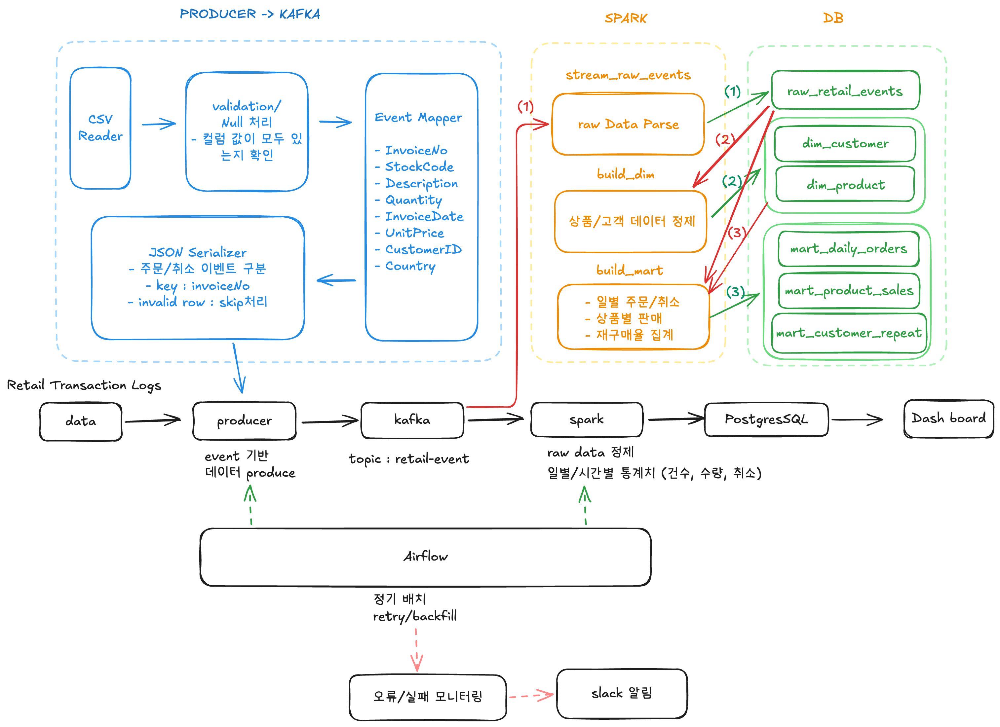

# 데이터 엔지니어링 프로젝트
## 프로젝트 개요
**Online Retail Event Collection Pipeline**

>💡본 프로젝트는 온라인 리테일 CSV 데이터를 실시간 이벤트처럼 재생하여 Kafka로 수집하는 파이프라인을 구현하였다. 각 거래 row를 주문 또는 취소 이벤트로 변환하고, `invoice_no`를 key로 하여 `retail-events` topic에 전송함으로써 Kafka 기반 이벤트 수집 구조를 설계하였다.


### 데이터

**Retail Transaction Logs**

구매 이력 데이터판매 분석 / 피크 시간 탐지

https://archive.ics.uci.edu/dataset/352/online%2Bretail

- data/online-retail.csv 에 저장

**컬럼**
- InvoiceNo : 송장번호 (앞에 C : 취소) 
- Description : 제품명 (상품 특성 구분)
- StockCode : 상품 코드(각 제품에 고유하게 할당된 5자리 정수)
- Quantity : 품목 수량
- InvoiceDate(dd/mm/yyyy hh:mi) : 각 거래가 생성된 날짜와 시간
- unitPrice : 제품 단위 가격 (영국 단위)
- customerID : 고객 ID(5자리 정수)
- Country : 고객 거주 국가명

### 흐름

CSV 원본 데이터 → Python Producer → Kafka Topic → Consumer/Spark(또는 향후 처리) → 저장 →Dashboard

## 파이프라인 구성도
https://excalidraw.com/#json=GSD5xY28rbdpiu6xE1Sjq,T8LC92omkhGyQoQa8jMpQA
![[total_online_retail_pipeline.png]]
## Kafka 수집 설계

### 설계 포인트

- 주문 / 취소 이벤트를 구분
- key는 `invoice_no`
- Kafka message key는 `InvoiceDate` 기준 오름차순 정렬 후 전송
- 이 때 `InvoiceDate`의  Year을 현재 기준으로 `target_date` 구성
	- `target_date`: 현재 일자 기준으로 데이터 필터링
- 날짜 파싱이 실패한 row는 제외
- `future.get()`을 통해 전송 결과를 확인하고 실패 시 **JSONL**로 저장

## Producer 코드 흐름
1. CSV 파일(`data/online_retail.csv`)을 읽는다.
2. `InvoiceDate` 컬럼을 datetime 형식으로 변환한다.
3. 날짜 변환이 실패한 row는 제외한다.
4. `InvoiceDate` 기준으로 오름차순 정렬한다.
5. `InvoiceDate` 에 15년을 더하여 `target_date`를 구성한다.
6. 각 row를 순회하면서 `InvoiceNo`가 `C`로 시작하는지 확인하여 이벤트 유형을 결정한다.
   - `C`로 시작하면 `cancel`
   - 그 외는 `order`
6. row 데이터를 JSON 메시지 형태로 변환한다.
7. `invoice_no`를 Kafka key로 하여 `retail-events` topic에 전송한다.
8. `future.get()`으로 전송 결과를 확인하고 로그를 출력하며, 실패 시 `JSONL`로 저장한다.
9. 종료 전 `flush()`와 `close()`를 호출하여 남은 메시지를 전송하고 리소스를 정리한다.

## 메시지 생성 방식

각 거래 row는 하나의 Kafka 메시지로 변환된다.

- `InvoiceNo`가 `C`로 시작하면 `cancel`
- 그 외는 `order`
- Kafka key는 `invoice_no`
- 메시지 값(value)은 JSON 형식

```
{
	'event_id': '536365-85123A', 
	'event_type': 'order', 
	'invoice_no': '536365', 
	'stock_code': '85123A', 
	'description': 'WHITE HANGING HEART T-LIGHT HOLDER', 
	'quantity': 6, 
	'category': 'A',
	'unit_price': 2.55, 
	'customer_id': '17850.0', 
	'country': 'United Kingdom', 
	'invoice_timestamp': '2026-12-01 08:26:00', 
	'target_date': '2026-12-01',
	'target_time': '08:26:00',
	'org_invoice_timestamp': '2010-12-01 08:26:00'
	'metadata': {
		'source': 'online_retail_csv', 
		'version': 'v1'
	}
}
```

## Topic 구성 방식
### Topic 정보
Topic 이름: retail-events
Topic 개수: 1개
역할: 온라인 리테일 주문 및 취소 이벤트 저장

### Partitioning 전략

주문 단위의 순서를 유지하며 처리할 수 있도록 설계
- Partition key: invoice_no

## Configuration

- topic name: `retail-events`
- partition key : `invoice_no`
- partitions: `3`
- replication factor: `1`
- key: `invoice_no`
- value format: JSON
- acks: `all`
- retries: `3`

## Error handling

### 전송 신뢰성 확보

- `acks='all'`
- `retries=3`
- 종료 전 `flush()` / `close()`

### 전송 결과 확인
producer.send() 이후 future.get()을 사용하여 전송 성공 여부를 확인하고 로그를 출력

### 데이터 정제 처리

- InvoiceDate 파싱 실패 row는 제외
- 그 외 세부적인 invalid row 처리 및 dead-letter 관리 로직은 현재 미구현
- 향후 별도 에러 로그 파일 등으로 확장 가능

---

# Spark 설계
### Spark 파이프라인 업데이트


## 데이터 흐름

- Producer가 Kafka topic `retail-events`로 주문/취소 이벤트를 전송한다.
- `stream_raw_retail_events`가 Kafka 메시지를 읽고, JSON 파싱 및 기본 전처리를 수행한 뒤 `raw_retail_events`에 적재한다.
- `batch_dim`가 `raw_retail_events`를 읽어 `dim_customer`, `dim_product`를 생성한다.
- `batch_mart`가 `raw_retail_events`, `dim_customer`, `dim_product`를 기반으로 일 단위 mart를 생성한다.
- Dashboard는 `mart_daily_orders`, `mart_product_sales`, `mart_customer_repeat`를 조회하여 차트를 생성한다.

## Spark 전처리 설계

### **Job 1. stream_raw_retail_events**

**📌데이터 처리 흐름**

- Kafka topic `retail-events`에서 JSON 메시지를 읽는다.
- 메시지에서 `invoice_no`, `stock_code`, `description`, `quantity`, `unit_price`, `customer_id`, `country`, `invoice_timestamp` 등을 추출한다.
- `event_type`을 생성한다. 주문/취소 여부는 원천 데이터 규칙에 따라 구분한다.
- `invoice_timestamp`를 기준으로 `invoice_date`, `invoice_time`를 파생한다.
- `ingested_at`, `load_run_id`를 추가한다.
- 중복 이벤트를 최소화한 뒤 `raw_retail_events`에 적재한다.

**📌구현 방식 :**

- streaming data

**📌역할:**

- source 읽기
- order/cancel 구분
- raw 적재

**📌입력:**

- CSV / Kafka / replay 데이터

**📌출력:**

- raw_retail_events

### **Job2. build_dim**

**📌 데이터 처리 흐름**

- `retail_events_raw`를 JDBC로 읽는다.
- 고객 기준으로 `first_purchase_at`, `last_purchase_at`, `total_order_count`를 계산하여 `dim_customer`를 생성한다.
- 상품 기준으로 `stock_code`, `category`, `product_name`, `latest_unit_price`를 정리하여 `dim_product`를 생성한다.
- 현재 단계에서는 batch 방식으로 전체 데이터를 다시 읽어 dimension을 생성하는 방식으로 설계한다.

**📌구현 방식 :**

- batch (일별)
    - 일단 `full refresh (overwrite)`
    - 추후 `incremental + merge` 고려

**📌역할:**

- raw  기반 product 중간 결과 생성 및 적재
- raw  기반 customer 중간 결과 생성 및 적재

**📌출력:** 

- dim_product
- dim_customer

### **Job 3. build_mart**

**📌 데이터 처리 흐름**

- `retail_events_raw`, `dim_customer`, `dim_product`를 읽는다.
- 날짜 기준으로 주문/취소 건수 및 금액을 집계하여 `mart_daily_orders`를 생성한다.
- 날짜+상품 기준 집계를 통해 `mart_product_sales`를 생성한다.
- 고객 재구매 기준을 적용하여 `mart_customer_repeat`를 생성한다.

**📌구현방식:**

- batch(일별 -dim 이후)

**📌역할:**

- raw와 dim 기반으로 mart 생성

**📌출력:**

- 일별 주문/취소 건수
- 상품별 판매량/매출
- 고객 재구매율
- 고객-상품 재구매 여부


### **데이터 흐름 구조 상세**
    
    1. Raw
    
    원천 이벤트 저장
    
    들어갈 것:
    
    - invoice_time : 주문 시간
    - invoice_date : 주문 일자
    - invoice_timestamp : 주문 일시
    - invoice_no : 주문ID
    - stock_code : 상품코드
    - category : 카테고리 (상품 코드 뒤 영문 - 없을 경우 ‘ETC’)
    - description : 상품명
    - customer_id : 고객 ID
    - quantity : 수량
    - unit_price : 단가
    - country : 나라
    - event_type(order / cancel) : 주문 구분
        - `invoice_no`가 `C`로 시작하면 cancel
        - 아니면 order
	 - org_invoice_timestamp : csv 내 기존 invoice_timestamp
    
    역할:
    
    - 원본 최대한 유지
    - 정제 최소화
    - “무슨 이벤트가 언제 발생했는지” 기록
    - invoice_date는 target_date, 즉 현재 일자를 기준으로 표현
    
    2. Product / Customer
    
    분석용 기준정보 생성
    
    [Product]
    
    - stock_code 기준 상품 식별
    - description 정리
    - category : stock_code의 코드 뒤 알파벳
        - 없으면 ‘ETC’
    
    [Customer]
    
    - customer_id 기준 고객 식별
    - 첫 구매일 / 마지막 구매일
    - 총 구매 횟수
    - 재구매 고객 여부 계산 기반
    
    역할:
    
    - raw를 바로 대시보드에 쓰지 않고
    - 분석 가능한 형태로 정리
    
    3. Mart
    
    대시보드용 집계
    
    - mart_daily_orders : 당일 구매율
    - mart_product_sales : 상품별 구매율
    - mart_customer_repeat : 고객 재구매율
    
    역할:
    
    - 차트/지표가 바로 붙을 수 있게 요약
    
    
        
        

## Error handling 전략

Spark 전처리 및 저장 과정에서 다음과 같은 예외 처리 전략을 적용한다.

- JSON 파싱 실패 시 해당 메시지는 적재 대상에서 제외하고 로그로 남긴다.
- `invoice_timestamp` 파싱이 실패한 경우 적재하지 않고 오류 데이터를 별도로 확인한다.
- `customer_id`, `stock_code` 등 dimension 생성에 필요한 주요 키가 null인 경우 `dim_customer`, `dim_product` 생성 대상에서 제외한다.
- 중복 이벤트는 `event_id` 기준으로 제거한다.
- streaming 적재 시 checkpoint를 사용하여 재시작 시 offset과 상태를 복구할 수 있도록 설계한다.
- batch 처리 실패 시 raw 데이터는 그대로 유지되므로 `batch_dim_data`, `batch_mart`는 재실행 가능하다.

## 처리 전/후 데이터 예시

### 입력 Kafka 메시지 예시

```
{
  "invoice_no":"536365",
  "stock_code":"85123A",
  "category:"A",
  "description":"WHITE HANGING HEART T-LIGHT HOLDER",
  "quantity":6,
  "unit_price":2.55,
  "customer_id":"17850",
  "country":"United Kingdom",
  "invoice_timestamp":"2010-12-01T08:26:00",
  "event_type":"order"
}
```

### 처리 후 `raw_retail_events` 적재 예시

```
{
  "event_id":"event_0001",
  "event_type":"order",
  "invoice_no":"536365",
  "stock_code":"85123A",
  "category":"A",
  "description":"WHITE HANGING HEART T-LIGHT HOLDER",
  "quantity":6,
  "unit_price":2.55,
  "customer_id":"17850",
  "country":"United Kingdom",
  "invoice_timestamp":"2026-12-01T08:26:00",
  "invoice_date":"2026-12-01",
  "invoice_time_str":"08:26:00",
  "ingested_at":"2026-04-22T21:10:00",
  "load_run_id":"run_001",
  "org_invoice_timestamp":"2010-12-01T08:26:00"
}
```

### 처리 후 `dim_customer` 예시

```
{
  "customer_id":"17850",
  "first_purchase_at":"2010-12-01T08:26:00",
  "last_purchase_at":"2010-12-09T12:10:00",
  "total_order_count":3,
  "country":"United Kingdom"
}
```

### 처리 후 `dim_product` 예시

```
{
  "stock_code":"85123A",
  "category":"A",
  "description":"WHITE HANGING HEART T-LIGHT HOLDER",
  "product_name":"WHITE HANGING HEART T-LIGHT HOLDER",
  "latest_unit_price":2.55
}
```

## DB구조 설계

### 저장소 선택

저장소

- PostgreSQL 기반의 관계형 DB를 사용

선택 이유

- Spark JDBC 연동이 가능
- raw / dim / mart 계층을 테이블 단위로 구분하여 저장 용이
- SQL 기반 조회가 가능하므로 이후 Dashboard와 연계하기에도 적합

`raw_retail_events`, `dim_customer`, `dim_product`, `mart_daily_orders`, `mart_product_sales`, `mart_customer_repeat`를 모두 DB 테이블로 관리하는 구조


### 저장 주기 및 방식

- `raw_retail_events`: streaming append 적재
- `dim_customer`, `dim_product`: batch 적재
- `mart_daily_orders`, `mart_product_sales`, `mart_customer_repeat`: batch 적재

현재 단계에서는 `batch_dim_data`와 `batch_mart`를 일 단위 batch로 구성한다.

### DB 구조

```sql
CREATE DATABASE retail_pipeline;

-- raw 데이터 저장
CREATE TABLE raw_retail_events(
    event_id VARCHAR(100) PRIMARY KEY,
    event_type VARCHAR(20) NOT NULL,
    invoice_no VARCHAR(30),
    stock_code VARCHAR(5),
    category VARCHAR(5),
    description TEXT,
    quantity INT,
    unit_price NUMERIC(10,2),
    customer_id VARCHAR(5),
    country VARCHAR(100),
    invoice_timestamp TIMESTAMP NOT NULL,
    invoice_date DATE NOT NULL,
    invoice_time VARCHAR(8),   -- HH:mm:ss
    org_invoice_timestamp TIMESTAMP NOT NULL,
    ingested_at TIMESTAMP NOT NULL,
    load_run_id VARCHAR(50) NOT NULL
);

-- customer
CREATE TABLE dim_customer (
    customer_id VARCHAR(30) PRIMARY KEY,
    first_purchase_at TIMESTAMP,
    last_purchase_at TIMESTAMP,
    total_order_count INT NOT NULL DEFAULT 0,
    country VARCHAR(20)
);

-- product
CREATE TABLE dim_product (
    stock_code VARCHAR(30) PRIMARY KEY,
    category VARCHAR(30),
    description TEXT,
    product_name TEXT,
    latest_unit_price NUMERIC(10,2)
);

-- 당일 구매율
CREATE TABLE mart_daily_orders (
    order_date DATE PRIMARY KEY,
    total_event_cnt INT NOT NULL,
    order_cnt INT NOT NULL,
    cancel_cnt INT NOT NULL,
    total_sales_amount NUMERIC(12,2) NOT NULL,
    order_sales_amount NUMERIC(12,2) NOT NULL,
    cancel_sales_amount NUMERIC(12,2) NOT NULL,
    order_rate NUMERIC(5,2),
    cancel_rate NUMERIC(5,2)
);

-- 상품별 집계
CREATE TABLE mart_product_sales (
    order_date DATE NOT NULL,
    stock_code VARCHAR(30) NOT NULL,
    category VARCHAR(30),
    total_event_cnt INT NOT NULL,
    order_cnt INT NOT NULL,
    cancel_cnt INT NOT NULL,
    order_sales_amount NUMERIC(12,2) NOT NULL,
    cancel_sales_amount NUMERIC(12,2) NOT NULL,
    order_rate NUMERIC(5,2),
    cancel_rate NUMERIC(5,2),
    PRIMARY KEY (order_date, stock_code)
);

-- 고객 재구매율
CREATE TABLE mart_customer_repeat (
    order_date DATE PRIMARY KEY,
    total_customer_cnt INT NOT NULL,
    repeat_customer_cnt INT NOT NULL,
    repeat_customer_rate NUMERIC(5,2)
);
```

- `total_customer_cnt`: 해당 날짜까지 혹은 해당 날짜 기준 집계 대상 고객 수
- `repeat_customer_cnt`: 2회 이상 구매 고객 수
- `repeat_customer_rate`: 재구매 고객 비율

## 실행 방법

```bash
# stream_raw_events 실행
docker exec -it spark-master spark-submit \
  --master spark://spark-master:7077 \
  --packages org.apache.spark:spark-sql-kafka-0-10_2.12:3.4.1 \
  --jars /opt/spark-jars/postgresql-42.7.3.jar \
  /opt/spark-apps/stream_raw_events.py
```

```bash
# build_dim 실행
docker exec -it spark-master spark-submit \
  --master spark://spark-master:7077 \
  --packages org.apache.spark:spark-sql-kafka-0-10_2.12:3.4.1 \
  --jars /opt/spark-jars/postgresql-42.7.3.jar \
  /opt/spark-apps/build_dim.py
```

# Airflow 설계 및 구현

## Airflow DAG 설계

본 프로젝트에서는 Kafka Producer, Spark Structured Streaming, PostgreSQL 적재, Dimension/Mart 테이블 생성 및 실패 시 backfill의 과정을 Airflow DAG로 관리한다.

Airflow는 직접 데이터를 처리하기보다는, 각 처리 단계의 실행 순서와 의존성을 관리하는 역할을 담당한다.

---

### 1. DAG 목적 및 실행 단위

본 프로젝트의 DAG는 수집 단계와 가공 단계를 분리하여 구성했다.

| DAG ID                    | 실행 단위            | 목적                                                 |
| ------------------------- | ---------------- | -------------------------------------------------- |
| `setup_retail_pipeline`   | 수동 실행 / 초기 적재 단위 | Kafka Topic 생성, Raw 테이블 초기화, Spark Streaming 실행    |
| `hourly_retail_ingestion` | 매시간 실행           | streaming alive 여부 확인, collector 실행                |
| `retail_pipeline`         | 매일 실행            | Raw 데이터를 기반으로 Dimension / Mart 테이블 생성              |
| `backfill_retail_jsonl`   | 매일 12:30 실행      | fallback JSONL 있으면 Kafka replay<br>raw/dim/mart 복구 |

#### 입력 / 출력

| DAG ID                    | 입력                             | 출력                                                                                                         |
| ------------------------- | ------------------------------ | ---------------------------------------------------------------------------------------------------------- |
| `setup_retail_pipeline`   | Kafka Topic `retail-events`    |                                                                                                            |
| `hourly_retail_ingestion` | Online Retail CSV              | PostgreSQL `raw_retail_events`                                                                             |
| `retail_pipeline`         | PostgreSQL `raw_retail_events` | `dim_customer`, `dim_product`, `mart_daily_orders`, `mart_product_sales`                                   |
| `backfill_retail_jsonl`   | fallback JSONL                 | PostgreSQL `raw_retail_events`<br>`dim_customer`, `dim_product`, `mart_daily_orders`, `mart_product_sales` |

---

### 2. DAG 구조 및 Task 의존성

#### `setup_retail_pipeline`

```text
reset_raw_table 
    ↓
create_kafka_topic
    ↓
start_stream_raw_events
    ↓
check_stream_alive
```

- kafka topic 및 streaming으로 데이터를 전달할 기반을 마련
##### Task의 역할

| Task                      | 역할                                  |
| ------------------------- | ----------------------------------- |
| `reset_raw_table`         | Raw 테이블 초기화 및 Spark checkpoint 삭제   |
| `create_kafka_topic`      | Spark Streaming 실행 전 Kafka Topic 생성 |
| `start_stream_raw_events` | Spark Structured Streaming Job 실행   |
| `check_stream_alive`      | Spark Streaming 프로세스 실행 여부 확인       |


#### `hourly_pipeline_ingestion`

```
check_stream_alive
↓
run_collector
↓
wait_and_check_raw_count
```

- streaming이 잘 동작하는 지 확인 후 매 시간 마다 producer를 통해 해당 시간의 데이터를 전달
- CSV 데이터를 실제 데이터처럼 움직이도록 구성하기 위해 이와 같이 구성
##### Task의 역할
| Task                 | 역할                            |
| -------------------- | ----------------------------- |
| `check_stream_alive` | Spark Streaming 프로세스 실행 여부 확인 |
| `run_collector`      | Kafka Producer 실행             |
| `check_raw_count`    | PostgreSQL Raw 테이블 적재 건수 확인   |


#### `retail_pipeline`

```text
build_dim_customer
    ↓
build_dim_product
    ↓
build_mart_daily_orders
    ↓
build_mart_product_sales
    ↓
build_mart_customer_repeats
```

-  Raw 테이블에 적재된 데이터를 기준으로 분석용 Dimension / Mart 테이블을 생성

#### `backfill_retail_jsonl`

```
create_kafka_topic
   ↓
check_spark_streaming
   ↓
prepare_jsonl_file
   ↓
replay_jsonl_to_kafka
   ↓
check_raw_count
   ↓
build_dim
   ↓
build_mart
   ↓
check_agg_count
   ↓
archive_processed_jsonl
```

- 매일 12:30 실행 하여 pending 파일을 processing으로 옮김
- fallback JSONL 있으면 Kafka replay
- 성공 시 raw/dim/mart 복구, 실패 시 error JSONL로 저장됨

##### Task의 역할

| Task                    | 역할                                     |
| ----------------------- | -------------------------------------- |
| prepare_jsonl_file      | DAG에서는 먼저 pending 파일을 processing으로 옮긴다 |
| replay_jsonl_to_kafka   | replay 실행 task                         |
| archive_processed_jsonl | 성공 시 `processed`로 저장                   |


### 3. Task 간 데이터 전달 방식

Task 간 데이터는 XCom으로 직접 전달하지 않고, Kafka와 PostgreSQL을 통해 전달한다.

Producer
→ Kafka Topic
→ Spark Streaming
→ PostgreSQL Raw Table
→ Dimension / Mart Batch Table

이 방식은 각 처리 단계를 느슨하게 분리할 수 있고, 중간 저장소를 기준으로 재처리 및 검증이 가능하다는 장점이 있다.

### 4. 스케줄

Kafka Producer가 샘플 데이터를 직접 발행하는 구조이다.
Spark Streaming 실행 여부를 먼저 확인한 뒤 Producer를 실행해야 한다.
이러한 한계를 극복하여 Streaming 형식으로 구현하기 위해, 데이터를 `hourly`로 실행하여, 해당 시간 내의 데이터를 전달한다.
retail_pipeline DAG는 일 단위 배치로 실행할 수 있다.

| Task                      | 스케줄          | 역할                                                                                                          |
| ------------------------- | ------------ | ----------------------------------------------------------------------------------------------------------- |
| `setup_retail_pipeline`   | `None`       | 최초 시작 시 실행되어 kafka topic 및 streaming 기반 마련                                                                  |
| `hourly_retail_ingestion` | `@hourly`    | 시간단위로 producer를 발행하여 아래의 기준으로 데이터를 적재한다. <br>`data_interval_start <= invoice_timestamp < data_interval_end` |
| `retail_pipeline_dag`     | `@daily`     | 하루 데이터가 마무리 된 후 전체 데이터를 기준으로 고객, 상품 데이터 overwrite, <br>일별 주문 집계, 일별 상품 판매량, 일별 고객 재구매율 등의 데이터 append        |
| `backfill_retail_jsonl`   | `30 0 * * *` | `backfill JSONL`이 있는 경우 재처리하여 다시 raw 데이터 및 코어데이터, 집계 데이터 적재                                                 |

### 5. Retry / Backoff / Failure Handling

Airflow Task는 네트워크, DB 연결, Kafka/Spark 실행 지연과 같은 일시적 실패에 대비하여 retry를 적용할 수 있도록 설계했다.

재시도가 의미 있는 실패와 의미 없는 실패는 다음과 같이 구분했다.

| 실패 유형                       | Retry 여부       | 처리 방식                          |
| --------------------------- | -------------- | ------------------------------ |
| Kafka / PostgreSQL 일시 연결 실패 | Retry 대상       | 일정 시간 후 재시도                    |
| Spark Worker 등록 지연          | Retry 대상       | 대기 후 재시도                       |
| Kafka Topic 미생성             | Retry보다는 사전 생성 | `create_kafka_topic` Task에서 처리 |
| 스키마 파싱 실패                   | Retry 대상 아님    | 로그 확인 후 코드 또는 데이터 수정           |
| 데이터 품질 오류                   | Retry 대상 아님    | 별도 검증 및 격리 필요                  |

### 6. Idempotency 재실행 안전성

같은 DAG를 다시 실행해도 데이터가 중복 적재되거나 이전 실행 상태와 충돌하지 않도록 다음 처리를 추가했다.

- 해당 시간의 Raw 테이블 초기화
```sql
DELETE FROM order_detail

WHERE invoice_no IN (

SELECT invoice_no

FROM order_info

WHERE invoice_timestamp >= '{{data_interval_start.in_timezone("Asia/Seoul").strftime("%Y-%m-%d %H:%M:%S")) }}'

AND invoice_timestamp < '{{data_interval_end.in_timezone("Asia/Seoul").strftime("%Y-%m-%d %H:%M:%S")) }}'
```

- Spark Structured Streaming checkpoint 삭제 (최초 실행 시)
```bash
rm -rf /tmp/checkpoints/retail_events_raw
```

- Kafka Topic은 Spark Streaming 실행 전에 미리 생성
```bash
kafka-topics --create --if-not-exists --topic retail-events
```

이를 통해 DAG 재실행 시 이전 Spark offset 상태나 기존 Raw 데이터로 인한 충돌을 줄였다.

### 7. 실행 자동화

Airflow 실행과 DAG 트리거는 `run_pipeline.sh`로 자동화했다.

```bash
docker compose up -d zookeeper kafka postgres spark-master spark-worker airflow airflow-scheduler
docker compose up --no-start collector

docker compose exec airflow airflow dags unpause setup_retail_pipeline
docker compose exec airflow airflow dags trigger setup_retail_pipeline
```
collector는 Producer 역할을 하므로 Docker Compose 실행 시 바로 실행하지 않고, DAG 내부에서 Spark Streaming이 실행된 이후 시작되도록 구성했다.

### 8. Repo 구성

Airflow 실행을 위해 다음 파일을 구성했다.
```text
.
├── docker-compose.yml
├── Dockerfile.airflow
├── Dockerfile.spark
├── Dockerfile.collector
├── requirements.airflow.txt
├── requirements.spark.txt
├── requirements.collector.txt
├── run_pipeline.sh
├── app/
│   └── airflow/
│       └── dags/
│           ├── setup_retail_pipeline.py
│           ├── retail_pipeline_dag.py
│           ├── hourly_retail_ingestion.py
│           └── backfill_retail_jsonl.py 
├── jobs/
│   ├── stream_raw_events.py
│   ├── build_dim.py
│   └── build_mart.py
├── producer.py
└── replay_fallback_jsonl.py
```
### 9. 정리

Airflow를 통해 단순히 스크립트를 순서대로 실행하는 방식이 아니라, 데이터 파이프라인의 실행 순서, 의존성, 재실행 안전성, 검증 단계를 관리하도록 구성했다.

수집 단계는 setup_retail_pipeline, 가공 단계는 retail_pipeline으로 분리하여 DAG의 역할을 명확히 구분했다.

---

# 로드 테스트 및 장애 대응

## 1. 현재 파이프라인 구조

본 프로젝트는 Online Retail CSV 데이터를 기반으로 Kafka, Spark Streaming, PostgreSQL, Airflow를 이용한 데이터 파이프라인을 구성하였다.

전체 흐름은 다음과 같다.

CSV 원본 데이터
→ Python Collector / Producer
→ Kafka topic: retail-events
→ Spark Streaming
→ PostgreSQL raw_retail_events
→ Airflow Batch DAG
→ dim / mart 테이블 생성

주요 구성 요소는 다음과 같다.

| 구성 요소 | 역할 |
|---|---|
| Collector / Producer | CSV 데이터를 읽어 Kafka 메시지로 발행 |
| Kafka | 이벤트 메시지 저장 및 스트리밍 전달 |
| Spark Streaming | Kafka 메시지를 읽어 PostgreSQL raw 테이블에 적재 |
| PostgreSQL | raw / dim / mart 데이터 저장 |
| Airflow | 배치 처리, backfill, 검증 작업 오케스트레이션 |
| Slack Alert | DAG 실패 또는 장애 발생 시 알림 전송 |

## 2. 부하 테스트 시나리오

### 2.1 테스트 목적

Producer가 짧은 시간 안에 대량의 메시지를 Kafka로 발행했을 때, Kafka, Spark Streaming, PostgreSQL이 정상적으로 데이터를 처리할 수 있는지 확인한다.

특히 다음 항목을 확인한다.

1. Kafka topic의 offset이 정상적으로 증가하는지
2. Spark Streaming이 Kafka 메시지를 계속 consume하는지
3. PostgreSQL raw_retail_events 테이블에 데이터가 정상 적재되는지
4. 발행 건수와 적재 건수 사이에 누락이 발생하는지
5. 처리 지연 또는 장애 발생 시 어떤 대응이 필요한지

### 2.2 테스트 방식

기존 Producer는 실시간 흐름을 흉내내기 위해 메시지 발행 사이에 sleep을 두었다.

로드 테스트에서는 sleep을 제거하거나 매우 짧게 설정하여 데이터를 빠르게 발행한다.

예시 조건은 다음과 같다.

| 항목          | 값                                                      |
| ----------- | ------------------------------------------------------ |
| Kafka topic | retail-events                                          |
| 테스트 구간      | 2026-01-20 00:00:00 ~ 2026-04-20 00:00:00              |
| 메시지 발행 방식   | sleep 없이 연속 발행                                         |
| 검증 대상       | Kafka offset, Spark Streaming 로그, PostgreSQL raw count |
| 기대 결과       | 발행 건수와 raw 적재 건수가 일치하거나, 차이가 발생할 경우 원인 확인              |

### 2.3 평상시 vs 피크 시나리오
본 프로젝트에서는 실시간 쇼핑몰 주문 이벤트 수집 상황을 가정한다.
평상시에는 주문 이벤트가 일정한 간격으로 발생하지만, 피크 상황에서는 짧은 시간 동안 주문 이벤트가 집중적으로 발생할 수 있다.
예를 들어 다음과 같은 상황을 피크 시나리오로 볼 수 있다.
1. 특정 시간대 주문량 증가
2. 할인 이벤트 또는 프로모션 기간
3. 배치성 데이터 재처리
4. 장애 복구 후 누락 구간 재발행
5. Producer가 sleep 없이 데이터를 연속 발행하는 경우테스트 기준은 다음과 같이 나누었다.

| 구분 | Producer 동작 방식 | 목적 |
|---|---|---|
| 평상시 | 메시지 발행 사이에 sleep 적용 | 일반적인 실시간 이벤트 흐름 재현 |
| 피크 시 | sleep 없이 연속 발행 | 짧은 시간 동안 대량 이벤트 유입 상황 재현 |
| 장애 복구 시 | 특정 target interval 재발행 | 누락 구간 backfill 상황 재현 |

평상시 실행 예시는 다음과 같다.

```bash
docker exec \
  -e TARGET_START='2025-12-10 00:00:00' \  
  -e TARGET_END='2025-12-11 00:00:00' \  
  -e PRODUCER_SLEEP='0.1' \  
  collector \  
  python /app/producer.py
```

피크 상황 실행 예시는 다음과 같다.

```
docker exec \
  -e TARGET_START='2025-12-10 00:00:00' \  
  -e TARGET_END='2025-12-11 00:00:00' \  
  -e PRODUCER_SLEEP='0' \  
  collector \  
  python /app/producer.py
```
#### producer의 sleep 환경변수 수정

```python
import os
import time

producer_sleep = float(os.getenv("PRODUCER_SLEEP", "0.1"))

for row in rows:
    producer.send(TOPIC, value=message)

    if producer_sleep > 0:
        time.sleep(producer_sleep)
```

### 2.4 Local 환경의 리소스 제약  
  
본 테스트는 로컬 Docker 환경에서 수행되므로 CPU, 메모리, 디스크 I/O, 컨테이너 리소스가 제한적이다.  
  
이로 인해 다음과 같은 제약이 존재한다.  
  
| 항목        | 제약 사항                                                       |     |
| --------- | ----------------------------------------------------------- | --- |
| CPU       | Kafka, Spark, PostgreSQL, Airflow가 하나의 로컬 머신 자원을 공유         |     |
| Memory    | 여러 컨테이너가 동시에 실행되어 메모리 부족 가능성 존재                             |     |
| Disk I/O  | Kafka log, Spark checkpoint, PostgreSQL write가 모두 로컬 디스크 사용 |     |
| Network   | 실제 분산 환경이 아닌 Docker 내부 네트워크 사용                              |     |
| Scale-out | Kafka broker, Spark worker, PostgreSQL이 단일 노드 중심으로 구성       |     |
  
따라서 본 테스트에서는 실제 운영 수준의 대규모 트래픽을 재현하기보다는, 로컬 환경에서 가능한 범위 내에서 다음 항목을 확인하는 데 초점을 두었다.  
  
1. Producer 발행량 증가 시 Kafka offset 변화  
2. Spark Streaming consume 여부  
3. PostgreSQL raw 적재 건수 변화  
4. 장애 발생 시 backfill DAG를 통한 복구 가능성  
5. 로컬 환경에서 발생할 수 있는 병목 지점 확인  
  
또한 로컬 환경에서는 sleep 제거만으로 뚜렷한 장애가 발생하지 않을 수 있으므로, 필요 시 target interval 확대, Producer 동시 실행, Spark Streaming 중단 등의 방식으로 부하 또는 장애 상황을 재현한다.
### 2.5 Kafka offset 확인

```
docker compose exec kafka kafka-run-class kafka.tools.GetOffsetShell \  
--broker-list kafka:29092 \  
--topic retail-events \  
--time -1
```
- 시작 건수 : retail-events:0:146805 
- 종료 건수 : retail-events:0:250785

### 2.6 PostgreSQL 적재 건수 확인

```
docker compose exec postgres psql -U postgres -d retail_pipeline -c "SELECT COUNT(*) AS raw_count FROM raw_retail_events WHERE invoice_timestamp >= '2026-01-21 00:00:00'  AND invoice_timestamp <  '2026-04-20 00:00:00';"
```

 raw_count 
-----------
	97060
(적재되는데 약 15~20분)
### 2.7 부하 테스트 결과

이번 테스트에서 확인된 현상은 DB 적재 실패가 아니라 처리 지연에 가깝다.  
  
Producer는 Kafka에 빠르게 메시지를 발행할 수 있었지만, Spark Streaming은 Kafka에 쌓인 메시지를 순차적으로 consume한 뒤 PostgreSQL에 write하기 때문에 DB count는 Kafka offset보다 늦게 증가하였다.  
  
따라서 부하 상황에서는 다음 지표를 함께 확인해야 한다.

| 항목                   | 결과                                                    |
| -------------------- | ----------------------------------------------------- |
| 테스트 방식               | Producer sleep 제거                                     |
| Kafka offset         | 빠르게 증가                                                |
| PostgreSQL raw count | 즉시 반영되지 않고 점진적으로 증가                                   |
| 장애 여부                | 장애는 발생하지 않음                                           |
| 확인된 현상               | Kafka와 DB 적재 사이 처리 지연 발생                              |
| 원인 추정                | Spark Streaming consume/write 속도가 Producer 발행 속도보다 느림 |
| 대응 방향                | consumer lag 모니터링, raw count 검증, 지연 기준 초과 시 alert     |
	
## 3. 장애 시나리오 및 대응 전략

### 장애 시나리오 1. Spark Streaming 중단

#### 상황
Producer는 Kafka에 메시지를 정상 발행하지만 Spark Streaming이 중단되어 PostgreSQL raw 테이블에 데이터가 적재되지 않는 상황이다.

#### 확인 방법
- Kafka offset은 증가한다.
- Spark Streaming 프로세스가 존재하지 않는다.
- PostgreSQL raw count가 증가하지 않는다.

#### 대응 전략
1. Spark Streaming 프로세스 상태 확인
2. Spark 로그 확인
3. Spark Streaming 재기동
4. 장애 target interval 확인
5. backfill DAG 실행
6. raw count 재검증

```bash
docker compose exec airflow airflow dags trigger \  
-c '{"target_start":"2025-12-01 00:00:00","target_end":"2025-12-31 00:00:00"}' \ 
backfill_retail_pipeline
```
### 장애 시나리오 2. PostgreSQL write 지연 또는 실패

#### 상황
Kafka offset은 증가하고 Spark Streaming도 실행 중이지만, PostgreSQL raw count가 늦게 증가하거나 일정 시간 이상 증가하지 않는 상황이다.

#### 원인 후보
- PostgreSQL insert 성능 저하
- DB connection 문제
- table lock
- JDBC write 오류
- index 증가로 인한 insert 비용 증가

#### 대응 전략
1. DB count 증가 여부를 일정 간격으로 확인
2. Spark Streaming 로그에서 JDBC 오류 확인
3. PostgreSQL 로그 확인
4. 장시간 count가 증가하지 않으면 장애로 판단
5. 필요 시 Spark Streaming 재기동
6. target interval 기준 backfill 실행

#### 개선 방향
- batch insert 최적화
- raw table partitioning 검토
- 불필요한 index 최소화
- insert 실패 시 retry 적용
- 지연 기준 초과 시 Slack alert 발송

### 장애 시나리오 4. Producer 또는 Kafka 전송 실패

#### 상황
Producer가 Kafka에 메시지를 발행하지 못하는 상황이다.

예상 오류는 다음과 같다.

- KafkaTimeoutError
- NoBrokersAvailable
- Failed to update metadata
- Kafka broker connection refused

#### 확인 방법
- Kafka offset이 증가하지 않는다.
- Producer 로그에 전송 실패 오류가 발생한다.
- Kafka broker 상태를 확인한다.

#### 대응 전략
1. Producer retry 적용
2. Kafka broker 상태 확인
3. 전송 실패 메시지는 fallback JSONL 파일에 저장
4. Kafka 복구 후 fallback 파일 재전송
5. 매일 00:30에 fallback JSONL이 있을 경우 DAG를 통해 재처리 시도

### 3.4 운영 보완점  
  
- target_start / target_end 검증  
- KST 기준 시간대 통일  
- raw count 검증 task 추가  
- Slack alert  

## 4. Backfill DAG 설계
### 4.1 Backfill이 필요한 이유

실시간 파이프라인에서는 Producer, Kafka, Spark Streaming, PostgreSQL 중 하나라도 장애가 발생하면 특정 시간 구간의 데이터가 누락될 수 있다.이때 전체 데이터를 처음부터 다시 처리하는 것은 비효율적이므로, 장애가 발생한 target interval만 다시 처리할 수 있는 backfill DAG가 필요하다. 
본 프로젝트에서는 `target_start`, `target_end`를 Airflow DAG conf로 전달하여 특정 구간만 재처리할 수 있도록 구성하였다.
### 4.2 DAG 구조
```text
backfill_retail_jsonl
   ↓
create_kafka_topic
   ↓
check_spark_streaming
   ↓
prepare_jsonl_file
   ↓
replay_jsonl_to_kafka
   ↓
check_raw_count
   ↓
build_dim
   ↓
build_mart
   ↓
check_agg_count
   ↓
archive_processed_jsonl
```

### 4.3 처리 흐름

1. fallback JSONL이 적재된다.
2. Airflow에서 `backfill_retail_jsonl` DAG를 매일 밤 12시 반에 실행한다.
3. DAG 실행 시 `replay_fallback_jsonl.py`를 통해 fallback JSONL을 파싱한다.
4. Collector가 파싱한 데이터를 Kafka로 재발행한다.
5. Spark Streaming이 Kafka 메시지를 다시 읽어 PostgreSQL에 적재한다.
6. `check_raw_count` task에서 적재 건수를 확인한다.
7. 이후 기존 `retail_pipeline` DAG를 실행하여 dim/mart 테이블을 재생성한다.
8. JSONL 파일을 성공 시 processed로 이동, 실패 시 error로 이동

## 5. Fallback / Alert 전략  
  
### 5.1 Slack Alert  
  
Airflow task 실패 시 Slack으로 알림을 전송한다.  
  
알림 대상은 다음과 같다.  
  
1. backfill DAG 실패  
2. Producer 실행 실패  
3. raw count 검증 실패  
4. Spark Streaming 프로세스 미실행  
5. PostgreSQL 연결 실패  
  
*추후 구상 예정*
### 5.2 Producer Fallback

Kafka 연결 실패 또는 메시지 전송 timeout이 발생하면, 전송 실패 메시지를 fallback JSONL 파일에 저장한다.

이후 Kafka가 복구되면 fallback 파일을 다시 읽어 재전송할 수 있다.

예시 형태:

```
{"event_id":"INV001-85123","invoice_no":"536365","stock_code":"85123A","error":"KafkaTimeoutError","failed_at":"2026-05-03T21:30:00"}{"event_id":"INV002-71053","invoice_no":"536366","stock_code":"71053","error":"KafkaTimeoutError","failed_at":"2026-05-03T21:30:01"}
```

### 5-2. Backfill DAG conf JSON

이건 fallback JSON 파일이 아니라 Airflow 실행 파라미터야.

```
docker compose exec airflow airflow dags trigger backfill_retail_ingestion \
  --conf '{"target_start":"2025-12-01 00:00:00","target_end":"2025-12-02 00:00:00"}'
```

문서에서는 이렇게 구분해주면 좋아.

```
Producer fallback JSONL은 실패 메시지를 보관하기 위한 파일이고, Airflow DAG conf JSON은 backfill 실행
```
## 6. 테스트 결과

## 7. 한계점 및 개선 방향

### 7.1 한계점

1. 로컬 Docker Compose 환경에서 테스트하였기 때문에 실제 운영 환경 수준의 부하를 재현하기 어렵다.
2. Kafka, Spark, PostgreSQL이 모두 단일 노드 구성이라 고가용성 검증은 제한적이다.
3. Spark Streaming 장애 감지는 수동 명령어 기반으로 확인하였다.
4. Kafka consumer lag을 정교하게 수집하지 못했다.
5. PostgreSQL insert 성능 병목을 정량적으로 분석하지는 못했다.
6. Airflow에서 docker compose 명령을 실행할 때 로컬 Docker 경로 및 권한 이슈가 발생할 수 있다.

### 7.2 개선 방향

1. Prometheus/Grafana를 연동하여 Kafka, Spark, PostgreSQL 지표를 시각화한다.
2. Kafka consumer lag을 주기적으로 수집하여 적재 지연을 탐지한다.
3. Spark Streaming 프로세스 상태를 Airflow sensor 또는 별도 health check로 감지한다.
4. PostgreSQL insert 성능 개선을 위해 batch insert, partitioning, index 최적화를 검토한다.
5. Airflow DAG 실패 시 Slack alert를 전송한다.
6. Backfill DAG 실행 시 raw count뿐 아니라 기대 건수와 실제 적재 건수를 비교하는 검증 task를 추가한다.

---
# API
## 1. API 사용 범위
| 구분        | 테이블                                                            | API 목적                        |
| --------- | -------------------------------------------------------------- | ----------------------------- |
| 상태 확인     | `raw_retail_events`, `mart_daily_orders`, `mart_product_sales` | 적재 건수 확인                      |
| 일별 매출 마트  | `mart_daily_orders`                                            | 날짜별 주문/취소/매출 확인               |
| 상품별 매출 마트 | `mart_product_sales`                                           | 상품별 판매량/매출/취소율 확인             |
| 원천 이벤트    | `raw_retail_events`                                            | 특정 `invoice_no` 기준 raw 이벤트 확인 |
| 고객 차원     | `dim_customer`                                                 | 특정 고객 정보 확인                   |

## 2. API 파일 구조 추가

```
api/
 └── main.py
requirements.api.txt
Dockerfile.api
```

## 3. `requirements.api.txt`

```
fastapi==0.115.6
uvicorn[standard]==0.34.0
psycopg2-binary==2.9.10
python-dotenv==1.0.1
```
## 4. `main.py`

### /health
api가 잘 연결됐는 지 체크 
```python
@app.get("/health")
def health_check():
    sql = "SELECT 1 AS ok"
    result = fetch_one(sql)

    return {
        "status": "ok",
        "db": result,
    }
```
### /api/v1/summary/counts
건수 체크
``` python
@app.get("/api/v1/summary/counts")
def get_table_counts(
    start_date: Optional[str] = Query(None, example="2025-12-01"),
    end_date: Optional[str] = Query(None, example="2025-12-31")
):
    """
    현재 주요 테이블에 데이터가 얼마나 적재되어 있는지 확인하는 API
    """
    sql = """
        SELECT 'order_info' AS table_name, COUNT(*) AS row_count
        FROM raw_retail_events
        WHERE invoice_date >= %(start_date)s::timestamp
          AND invoice_date <  %(end_date)s::timestamp

        UNION ALL

        SELECT 'mart_daily_orders' AS table_name, COUNT(*) AS row_count
        FROM mart_daily_orders
        WHERE order_date >= %(start_date)s::date
          AND order_date <  %(end_date)s::date

        UNION ALL

        SELECT 'mart_product_sales' AS table_name, COUNT(*) AS row_count
        FROM mart_product_sales
        WHERE order_date >= %(start_date)s::date
          AND order_date <  %(end_date)s::date
    """

    rows = fetch_all(sql, {
        "start_date": start_date,
        "end_date": end_date,
    })

    return {
        "data": rows
    }
```

### /api/v1/mart/daily-orders
일별 주문/취소 내역 조회 API
```python
@app.get("/api/v1/daily-order-info")
def get_daily_order_info(
    start_date: Optional[str] = Query(None, example="2025-12-01"),
    end_date: Optional[str] = Query(None, example="2025-12-31"),
    event_type: Optional[str] = Query(None, example="order", regex="^(order|cancel)$"),
):
    """
    일별/시간대별 주문 정보 API
     - order_info 테이블에 적재된 일별/ 시간대별 주문 정보를 조회하는 API
    """
    sql = """
        SELECT
            invoice_date,
            EXTRACT(HOUR FROM invoice_time::time) AS invoice_hour,
            COUNT(a.invoice_no) AS order_count,
            SUM(b.quantity) AS total_quantity,
            SUM(b.quantity * b.unit_price) AS total_revenue        
        FROM order_info a
        LEFT JOIN order_detail b ON a.invoice_no = b.invoice_no 
        WHERE (%(start_date)s IS NULL OR invoice_date >= %(start_date)s::date)
          AND (%(end_date)s IS NULL OR invoice_date <= %(end_date)s::date)
          AND (%(event_type)s IS NULL OR a.event_type = %(event_type)s)
          GROUP BY invoice_date, invoice_hour
        ORDER BY invoice_date ASC, invoice_hour ASC
    """

    rows = fetch_all(sql, {
        "start_date": start_date,
        "end_date": end_date,
        "event_type": event_type,
    })

    return {
        "data": rows
    }
```
### /api/v1/mart/product-sales
일별/시간대별 주문 정보 API
    - order_info 테이블에 적재된 일별/ 시간대별 주문 정보를 조회하는 API

```python
@app.get("/api/v1/daily-order-info")
def get_daily_order_info(
    start_date: Optional[str] = Query(None, example="2025-12-01"),
    end_date: Optional[str] = Query(None, example="2025-12-31"),
    event_type: Optional[str] = Query(None, example="order", regex="^(order|cancel)$"),
):
    """
    일별/시간대별 주문 정보 API
     - order_info 테이블에 적재된 일별/ 시간대별 주문 정보를 조회하는 API
    """
    sql = """
        SELECT
            invoice_date,
            EXTRACT(HOUR FROM invoice_time::time) AS invoice_hour,
            COUNT(a.invoice_no) AS order_count,
            SUM(b.quantity) AS total_quantity,
            SUM(b.quantity * b.unit_price) AS total_revenue        
        FROM order_info a
        LEFT JOIN order_detail b ON a.invoice_no = b.invoice_no 
        WHERE (%(start_date)s IS NULL OR invoice_date >= %(start_date)s::date)
          AND (%(end_date)s IS NULL OR invoice_date <= %(end_date)s::date)
          AND (%(event_type)s IS NULL OR a.event_type = %(event_type)s)
          GROUP BY invoice_date, invoice_hour
        ORDER BY invoice_date ASC, invoice_hour ASC
    """

    rows = fetch_all(sql, {
        "start_date": start_date,
        "end_date": end_date,
        "event_type": event_type,
    })

    return {
        "data": rows
    }
```

### /api/v1/summary/daily-orders
order_info 테이블에 적재된 요약 정보 조회 API
```python
@app.get("/api/v1/summary/daily-orders")
def get_order_info_summary(
    start_date: Optional[str] = Query(None, example="2025-12-01"),
    end_date: Optional[str] = Query(None, example="2025-12-31"),
):
    """
    order_info 테이블에 적재된 요약 정보 조회 API
    """
    sql = """
        SELECT
            sum(total_event_cnt) AS total_event_cnt,                -- 전체 이벤트 수
            sum(order_cnt) AS order_cnt,
            sum(cancel_cnt) AS cancel_cnt,
            sum(order_cnt) / NULLIF(sum(total_event_cnt), 0) AS order_rate,     -- 주문 비율
            sum(cancel_cnt) / NULLIF(sum(total_event_cnt), 0) AS cancel_rate    -- 취소 비율
        FROM mart_daily_orders
        WHERE (%(start_date)s IS NULL OR order_date >= %(start_date)s::date)
        AND (%(end_date)s IS NULL OR order_date <= %(end_date)s::date)
    """

    rows = fetch_all(sql, {
        "start_date": start_date,
        "end_date": end_date,
    })

    return {
        "data": rows
    }
```

### /api/v1/summary/daily-product-sales
일별 상품 판매량
```python
@app.get("/api/v1/summary/daily-product-sales")
def get_product_sales(
    start_date: Optional[str] = Query(None, example="2025-12-01"),
    end_date: Optional[str] = Query(None, example="2025-12-31"),
    event_type: Optional[str] = Query(None, example="order", regex="^(order|cancel)$"),
    category: Optional[str] = Query(None, example="ETC"),
):
    """
    일별 상품 판매량
    """
    sql = """
        SELECT
            stock_code,
            category,
            CASE WHEN (%(event_type)s = 'order') THEN order_cnt 
                WHEN (%(event_type)s = 'cancel') THEN cancel_cnt
                ELSE order_cnt + cancel_cnt END AS event_cnt,
            CASE WHEN (%(event_type)s = 'order') THEN order_rate 
                WHEN (%(event_type)s = 'cancel') THEN cancel_rate
                ELSE order_rate + cancel_rate END AS event_rate
        FROM mart_product_sales
        WHERE (%(start_date)s IS NULL OR order_date >= %(start_date)s::date)
          AND (%(end_date)s IS NULL OR order_date <= %(end_date)s::date)
          AND (%(category)s IS NULL OR category = %(category)s)
        ORDER BY event_cnt DESC
        LIMIT 5
    """

    rows = fetch_all(sql, {
        "start_date": start_date,
        "end_date": end_date,
        "event_type": event_type,
        "category": category,
    })

    return {
        "data": rows,
    }
```

### /api/v1/summary/daily-customer-repeats
```python
@app.get("/api/v1/summary/daily-customer-repeats")
def get_customer_repeats(
    start_date: Optional[str] = Query(None, example="2025-12-01"),
    end_date: Optional[str] = Query(None, example="2025-12-31"),
):
    """
    고객 재구매율 조회
    """
    sql = """
        SELECT
            order_date,
            total_customer_cnt,
            repeat_customer_cnt,
            repeat_customer_rate
        FROM mart_customer_repeat
        WHERE (%(start_date)s IS NULL OR order_date >= %(start_date)s::date) 
          AND (%(end_date)s IS NULL OR order_date <= %(end_date)s::date)
        ORDER BY order_date ASC
    """

    rows = fetch_all(sql, {
        "start_date": start_date,
        "end_date": end_date,
    })

    return {
        "data": rows,
    }
```

---

## 5. `Dockerfile.api`

```
FROM python:3.11-slim

WORKDIR /app

COPY requirements.api.txt .

RUN pip install --no-cache-dir -r requirements.api.txt

COPY api ./api

CMD ["uvicorn", "api.main:app", "--host", "0.0.0.0", "--port", "8000"]
```

## 6. `docker-compose.yml`에 API 서비스 추가

기존 compose에 아래 서비스를 추가
```
api:
    build:
        context: .
        dockerfile: Dockerfile.api
    container_name: retail-api
    ports:
        - "8000:8000"
    environment:
        DB_HOST: postgres
        DB_PORT: 5432
        DB_NAME: retail_pipeline
        DB_USER: postgres
        DB_PASSWORD: postgres
    depends_on:
        - postgres
    networks:
        - kafka-network

```

## 7. 실행
```bash
docker compose up -d api
```

```
http://localhost:8000/health
```

![[API_serving.png]]

## 8. 대시보드와의 연동
### 대시보드 환경
- 언어: Java 17, JavaScript
- 프레임워크: Spring Boot 4.0.6
- View : JSP
- 대시보드 표현 플러그인 : apexcharts.js

### 실행
```
http://localhost:8082/main
```

![[Dashboard_img.png]]

---
# 향후 과제 
- slack 알람 추가
- 현재 hourly로 스케쥴링 하는 방식 보다 더 자연스러운 방식 확인해보기


